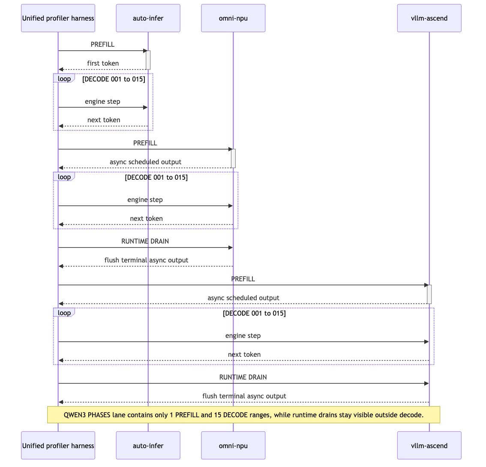
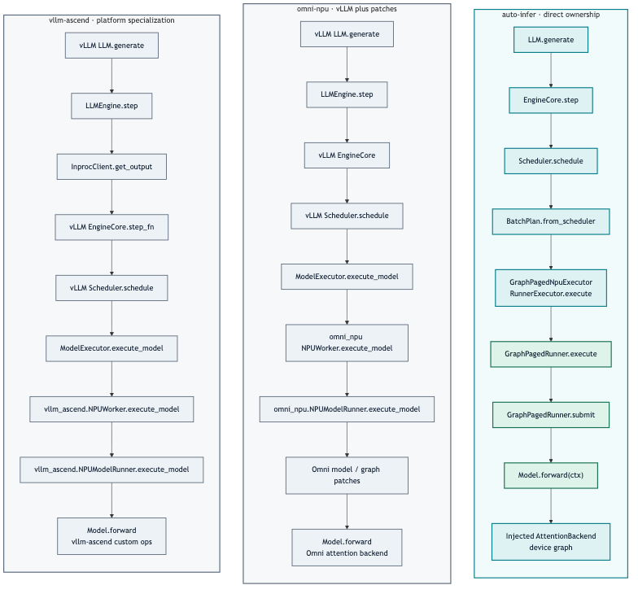
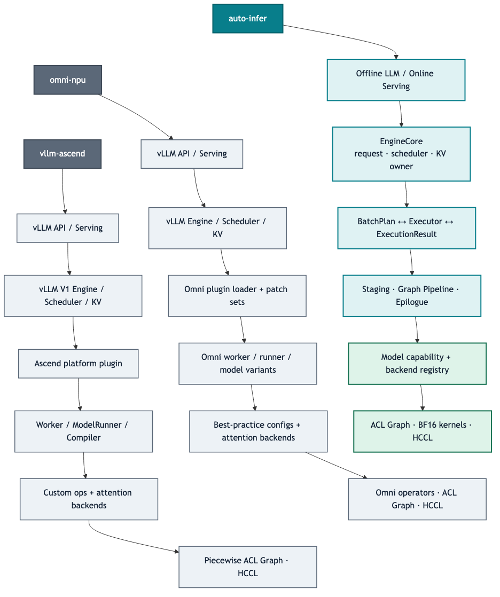

# auto-infer 架构与 Qwen3 性能审计报告

> 面向管理层与工程师的文本版报告。数据源与 HTML 版完全相同；生成器不维护第二套手写指标。

## 管理结论

在 `Qwen3-0.6B`、单张 `Ascend 910B1`、`bfloat16` greedy、每框架 `14,464` usable KV tokens 的验收边界内，auto-infer 的稳态延迟、吞吐、启动、等容量内存与稳定性均为本次第一。

- B16 吞吐：**2,259.2 tok/s**。
- 相对 omni-npu：**1.15×**；相对 vllm-ascend：**2.66×**。
- auto-infer 与 vllm-ascend 的 128-token digest 一致；omni-npu 长度一致但 digest 不同，因此只声明性能可比，不声明 token identity。
- 结论仅适用于已测模型、shape、BF16 精度和单卡拓扑；不能外推到未测模型、量化或分布式规模。

## Matched benchmark

权威 headline 来自无 profiler 的 20 次测量；profiling 只用于解释，不替代性能排名。

| 指标 | 方向 | auto-infer | omni-npu | vllm-ascend |
| --- | --- | --- | --- | --- |
| Warm TTFT | 越低越好 | 5.900 ms | 52.840 ms | 18.992 ms |
| TPOT | 越低越好 | 5.530 ms | 6.519 ms | 17.743 ms |
| B16 throughput | 越高越好 | 2,259.2 tok/s | 1,966.9 tok/s | 847.9 tok/s |
| Engine load + graph | 越低越好 | 1.484 s | 52.045 s | 44.482 s |
| Peak torch allocation | 越低越好 | 2.787 GiB | 9.731 GiB | 2.797 GiB |
| Throughput CV | 越低越好 | 0.700 % | 0.745 % | 0.947 % |

## Qwen3 三框架 profiling

每份 trace 捕获同一个 B16、16-token generate：**1 次 prefill + 15 次连续 decode**。这是连续多步 decode，不是 speculative MTP。

### 如何直接找到 prefill

在 Chrome 的 `chrome://tracing` 或 Perfetto 中载入任一原始 JSON，然后找到置顶的 **`QWEN3 PHASES`** process：

1. 唯一的 **`PREFILL`** 是首个 engine step。
2. 后续依次是 **`DECODE 001`** 到 **`DECODE 015`**。
3. 这些是采集器写入三套框架的统一 host ranges；框架原生 operator、线程、stream 和 category 完整保留。

三份 JSON 的结构和事件数不同是预期现象：auto-infer、omni-npu 和 vllm-ascend 暴露的 Python/C++/ACL graph、async queue 与 runtime 元数据层级不同。可比性来自统一 workload、输出长度、KV 容量、设备、精度和 `QWEN3 PHASES` 边界，而不是要求三份 trace 长得一样。

| 框架 | 请求范围 | PREFILL host range | 15 个 DECODE 合计 | 原生 complete events | 原始 Trace |
| --- | --- | --- | --- | --- | --- |
| auto-infer | 188.62 ms | 51.14 ms | 136.53 ms | 64,947 | [raw/auto-infer.trace.json](profiling/qwen3/raw/auto-infer.trace.json) |
| omni-npu | 196.16 ms | 58.32 ms | 131.84 ms | 41,302 | [raw/omni-npu.trace.json](profiling/qwen3/raw/omni-npu.trace.json) |
| vllm-ascend | 362.67 ms | 22.58 ms | 333.05 ms | 38,839 | [raw/vllm-ascend.trace.json](profiling/qwen3/raw/vllm-ascend.trace.json) |

### 逐步 phase 索引

下面是 host range，不是 NPU kernel 独占时间；异步 device stream 可能越过 host range，不能把这些数直接当作纯算子耗时。

| 阶段 | auto-infer | omni-npu | vllm-ascend |
| --- | --- | --- | --- |
| PREFILL | 51.144 ms | 58.324 ms | 22.576 ms |
| DECODE 001 | 9.365 ms | 9.142 ms | 22.570 ms |
| DECODE 002 | 8.921 ms | 8.664 ms | 22.031 ms |
| DECODE 003 | 8.903 ms | 8.615 ms | 21.811 ms |
| DECODE 004 | 8.903 ms | 8.588 ms | 21.846 ms |
| DECODE 005 | 8.882 ms | 8.595 ms | 21.752 ms |
| DECODE 006 | 8.947 ms | 9.650 ms | 22.724 ms |
| DECODE 007 | 9.058 ms | 8.727 ms | 22.545 ms |
| DECODE 008 | 9.318 ms | 8.804 ms | 22.006 ms |
| DECODE 009 | 9.177 ms | 8.729 ms | 21.979 ms |
| DECODE 010 | 9.144 ms | 8.773 ms | 22.003 ms |
| DECODE 011 | 9.247 ms | 8.705 ms | 22.117 ms |
| DECODE 012 | 9.068 ms | 8.696 ms | 23.177 ms |
| DECODE 013 | 9.183 ms | 8.700 ms | 22.221 ms |
| DECODE 014 | 9.191 ms | 8.652 ms | 22.114 ms |
| DECODE 015 | 9.217 ms | 8.806 ms | 22.153 ms |

## 三框架调用栈对比

调用层数不是单独的性能结论；这里比较的是状态所有权、变化隔离和一次模型执行需要穿越的组件边界。符号按 manifest 锁定的源码版本核对。

| 框架 | 主调用栈 | 所有权 / 间接性 | 源码位置 |
| --- | --- | --- | --- |
| auto-infer | LLM.generate → EngineCore.step → Scheduler.schedule → BatchPlan.from_scheduler → GraphPagedNpuExecutor[RunnerExecutor.execute] → GraphPagedRunner.execute → GraphPagedRunner.submit → Model.forward(ctx) → AttentionBackend | EngineCore owns request、scheduler、KV 与 completion；执行层只交换短协议对象。 | auto_infer/entrypoints/llm.py · engine/engine_core.py · engine/execution.py · worker/graph_decode_runner.py |
| omni-npu | vLLM LLM.generate → LLMEngine.step → vLLM EngineCore → Scheduler.schedule → ModelExecutor.execute_model → omni_npu.NPUWorker.execute_model → omni_npu.NPUModelRunner.execute_model → model / graph patches → Model.forward | 上游 vLLM 生命周期、Omni plugin/patch、worker 与模型优化共同决定实际路径。 | vllm/entrypoints/llm.py · omni_npu/worker/npu_worker.py · omni_npu/worker/npu_model_runner.py |
| vllm-ascend | vLLM LLM.generate → LLMEngine.step → InprocClient.get_output → vLLM EngineCore.step_fn → Scheduler.schedule → ModelExecutor.execute_model → vllm_ascend.NPUWorker.execute_model → vllm_ascend.NPUModelRunner.execute_model → Model.forward | vLLM V1 保持通用 engine；Ascend plugin 在 platform、worker、runner、compiler 与 custom-op 层专化。 | vllm/v1/engine/llm_engine.py · vllm/v1/engine/core_client.py · vllm_ascend/worker/worker.py · worker/model_runner_v1.py |

## 为什么 auto-infer 更快

| 证据类型 | 环节 | 结论 | 依据 / 限制 |
| --- | --- | --- | --- |
| 实测 | B16 throughput | 2,259.2 tok/s；较 omni-npu 1.15×，较 vllm-ascend 2.66×。 | headline benchmark JSON |
| 源码观察 | Graph hot path | graph capture、staging、replay/update、epilogue 拆成可独立测试组件；热路径不做在线 capture。 | graph_decode_runner / graph_task_pipeline |
| 因果推断 | Replay + metadata pipeline | replay 后 side-stream 更新、event 排序和双缓冲减少 graph-task update 对下一步的阻塞。 | 与低 TPOT 及短 profiled request 一致；未做单变量 ablation |
| 源码观察 | Persistent staging | CPU/NPU 输入缓冲持久化，block table 仅上传 dirty row/span。 | staging / input stagers |
| 因果推断 | 较少 host/device 胶水 | 固定地址与脏更新降低逐步分配、拷贝和 Python 调度成本。 | trace 中 auto-infer request range 最短 |
| 源码观察 | Packed projections | QKV 与 gate/up 使用 packed weight；BF16 lm_head 与 greedy argmax 留在 captured epilogue。 | packed projections / decode epilogue |
| 因果推断 | 更少 kernel 与同步边界 | projection packing 与直接 argmax 降低 launch 数；收益随模型/shape 变化，必须重做 profiling。 | 机制合理但不能由相关性证明全部增益 |
| 实测 | Profiler window | B16 16-token 请求范围约 188.6 / 196.2 / 362.7 ms（auto / omni / vllm）。 | 三份 raw Chrome Trace |
| 实测 | Startup | 1.484 s vs 52.045 s vs 44.482 s；auto-infer 只捕获所需 gear，通用框架初始化面更宽。 | headline benchmark + framework logs |

领先来自较短且确定的热路径组合：启动期捕获合适 gear、固定地址输入、dirty metadata 更新、event 排序、packed projection，以及 graph 内 BF16 lm_head 与 greedy argmax。没有单变量 ablation 的机制只作为与结果一致的因果解释，不写成已独立证明的毫秒收益。

## 架构优劣详细对比

| 维度 | auto-infer | omni-npu | vllm-ascend |
| --- | --- | --- | --- |
| 核心控制流 | EngineCore → BatchPlan → Executor → ExecutionResult；协议短且状态归属明确。 | vLLM 主流程之上叠加环境选择的 patch 与额外配置。 | 复用成熟 vLLM engine，Ascend worker / runner / compiler 专化。 |
| 模型扩展 seam | 模型声明 attention / MTP capability；registry 注入对象，engine 不按模型分支。 | 模型实现、best-practice config 与 patches 共同决定路径。 | 覆盖广，但模型与平台 runner 的组合触点更多。 |
| 状态所有权 | Engine/service 单线程拥有 request、scheduler、KV、completion；跨线程传不可变视图。 | 上游 vLLM 状态与 patch 后行为共同形成所有权边界。 | 继承 vLLM 的多组件生命周期，成熟但阅读跨度更大。 |
| Graph 生命周期 | 启动期捕获；固定地址 staging；replay 后独立 stream metadata update；event + 双缓冲。 | NpuGraphEx + full/piecewise graph，依赖插件配置与 graph gear。 | torch.compile + ACL graph piecewise；支持较宽的通用 shape 集合。 |
| 输入与 KV metadata | 持久 pinned CPU/NPU buffer；block table 只传 dirty rows/span。 | 由 Omni runner 与 patched vLLM metadata 路径管理。 | 通用 input batch 和 worker metadata 路径，支持面广。 |
| Projection / epilogue | packed QKV、gate/up；BF16 captured lm_head + greedy argmax；避免外部 sampler step。 | 拥有广泛融合算子与模型专用优化配置。 | 平台 custom op、compiler fusion 与通用 sampler 体系。 |
| Continuous batching | scheduler/KV 生命周期有专项回归；同步路径是本负载已验证默认。 | 继承 vLLM scheduling，并通过 patch 增补行为。 | vLLM V1 scheduler 成熟，线上生态更完整。 |
| Serving | 单 service + broker + request-id demux；在线/离线共用核心执行协议。 | 成熟 vLLM serving，Omni patch OpenAI 与 scheduler 层。 | API、工具链、部署经验最成熟。 |
| Distributed / MoE | 命名 TP/DP/EP/CP/SP mesh；BF16 true all-to-all 接口与测试；深度仍有限。 | 并行与算子调优面最丰富，是明显强项。 | 上游并行体系成熟，Ascend 通信优化覆盖更广。 |
| MTP | 一个 two-stage recurrent graph path；geometry 从权重推导；unsupported fail-fast。 | Eagle / MTP patches 与模型优化覆盖更广。 | 上游 speculative decoding 生态更完整。 |
| P/D 与 MLA MTP | 仅保留未接线 P/D 低层接口；MLA MTP capability 保留但明确 unsupported。 | P/D、connector 与 MLA/MoE 产品能力更完整。 | connector / disaggregation 生态成熟。 |
| 维护与审计面 | 9,960 Python LOC / 93 files；无内部 import cycle；路径较短。 | 61,080 / 223；patch 提升适配力，也增加组合状态。 | 53,219 / 242；生态收益大，平台 runner 体量更高。 |

auto-infer 的核心优势是低间接性、明确所有权和较小扩展 seam；vllm-ascend 的优势是模型/API/部署生态成熟度，omni-npu 的优势是优化模型、算子和复杂并行覆盖。特性广度属于当前 scope 差异，不能反向证明核心架构质量。

## 什么不应该变化

- EngineCore → BatchPlan → Executor → ExecutionResult 协议
- request / scheduler / KV / completion 的单一所有权
- 模型声明 capability、registry 选择实现；engine 不加模型分支
- recurrent MTP 独立 capability；不支持时启动期 fail-fast
- graph-FIA capture / replay / update 的 event 顺序契约
- 固定地址持久 staging 与 dirty block-table 更新
- 精度优先：logits/token parity 先于性能排名
- P/D 未接线、MLA MTP unsupported 等边界必须显式
- matched manifest、raw samples、trace 和 hash 的证据保留

## 什么应针对每个模型重新生成

- checkpoint / config / weight-name inventory 与 adapter
- TP/EP head、expert、attention、RoPE 与 cache geometry
- KV budget、block size、scratch blocks、max sequence length
- packed QKV / gate-up 权重与 dtype / quantization metadata
- graph gear ladder、capture matrix、handles、memory envelope
- MTP layers、geometry、depth、position acceptance 与 capability
- BF16/FP32 head 与 sampling parity 阈值
- golden prompts、logits/token digest、eager/paged/graph identity
- unprofiled baseline、raw traces、phase map、CV 与回归阈值
- 实际声明的 TP/EP/SP/CP 拓扑验证

不变量只能通过版本化设计、跨模型回归和新 baseline 修改；模型生成物必须绑定 config、weights、软件与硬件 digest，不能只因 architecture class 同名而复用。

## 新模型生产验收流程

1. Checkpoint inventory：config、weights、digest。
2. Geometry generation：attention、KV、TP/EP、MTP。
3. Precision gates：reference logits、token identity、长上下文与边界 block。
4. Graph matrix：gear、内存、capture、fallback=0。
5. Stability：continuous batching、preemption、取消、KV 回收与 soak。
6. Matched ranking：无 profiler headline、raw JSON、phase trace、hash 与报告。

精度门失败时不进入性能排名；profiling 只能解释一个已经通过精度门的实现。

## 证据附录

| 框架 | 原始文件 | events | 大小 | SHA-256 |
| --- | --- | --- | --- | --- |
| auto-infer | [raw/auto-infer.trace.json](profiling/qwen3/raw/auto-infer.trace.json) | 85,343 | 13.9 MiB | `deabff830ba6cc30be105e40b2874bcdc7f389b4dbe406afb59aafa7f4a0bd8a` |
| omni-npu | [raw/omni-npu.trace.json](profiling/qwen3/raw/omni-npu.trace.json) | 59,764 | 9.2 MiB | `ccfef4c9f66ce5177bb3f1f480be0e2d52d333cd1ed022edc76f65f519b6fd2f` |
| vllm-ascend | [raw/vllm-ascend.trace.json](profiling/qwen3/raw/vllm-ascend.trace.json) | 55,388 | 8.4 MiB | `2aca519e0e23a212033369b1a86de731a3c215f479f0be594ff52d7e7ae65f7d` |

- [manifest.json](profiling/qwen3/manifest.json)：工作负载、环境与 artifact contract。
- [summary.json](profiling/qwen3/summary.json)：标准化 headline、operator 分类和 phase index。
- [provenance.json](profiling/qwen3/provenance.json)：模型、源码、驱动与采集来源。
- [HTML 报告](AUTO-INFER-ARCHITECTURE-AND-PERFORMANCE-REPORT.html)：同一证据的可视化版本。

### 限制

- profile window 只有 B16、16 tokens，并包含 profiler overhead。
- `PREFILL`/`DECODE` 是统一 host range；NPU 异步执行可能跨越 host 边界。
- operator category 的事件时间存在嵌套与并发，不能相加为 request wall time。
- 三方原生事件命名不同，operator-name 分类仍保留 unclassified；统一 phase lane 不伪造缺失的算子归因。
- 没有单变量 ablation，不声明每一毫秒都来自某一项单独优化。
